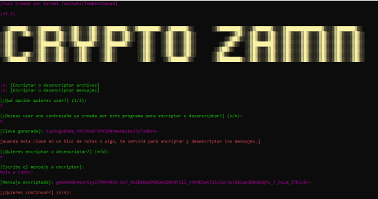

# Herramienta de Criptografía con Fernet ZAMN Tool

## Descripción


Esta herramienta permite encriptar y desencriptar archivos y mensajes de texto utilizando el algoritmo de criptografía simétrica **Fernet** de la librería `cryptography`. Ofrece dos opciones principales: encriptación y desencriptación de archivos y mensajes.

## Características

- **Encriptar/desencriptar archivos**: Protege tus archivos con una clave Fernet generada por la herramienta.
- **Encriptar/desencriptar mensajes**: Encripta y desencripta mensajes de texto con una clave Fernet.
- **Generación de claves**: Puedes generar nuevas claves de encriptación o usar una clave existente.
- **Interfaz sencilla**: Todo el proceso se realiza mediante la terminal con opciones fáciles de seguir.

## Requisitos previos

1. **Python 3.x** instalado en tu sistema.
2. La librería `cryptography` instalada. Si no la tienes, puedes instalarla con:

    ```bash
    pip install cryptography
    ```

## Cómo usar la herramienta

### 1. Ejecutar el script

Para comenzar a usar la herramienta, ejecuta el siguiente comando en tu terminal:

```bash
python zamntool.py

## 2. Opciones disponibles

### Opción 1: Encriptar o desencriptar archivos

Puedes usar una clave preexistente o generar una nueva.

Introduce la ruta del archivo que deseas encriptar o desencriptar y elige si deseas encriptarlo (e) o desencriptarlo (d).

### Opción 2: Encriptar o desencriptar mensajes

Similar a la opción de archivos, puedes elegir usar una clave preexistente o generar una nueva.

Introduce el mensaje que deseas encriptar o desencriptar.

## Flujo de uso

### Iniciar la herramienta

Cuando inicies el programa, se te presentarán dos opciones:

- Opción 1: Encriptar o desencriptar archivos.
- Opción 2: Encriptar o desencriptar mensajes.

### Clave

Puedes elegir entre usar una clave existente o generar una nueva.

- Si eliges usar una clave existente, deberás proporcionarla cuando se te solicite.
- Si eliges generar una nueva clave, la herramienta te proporcionará una clave que podrás guardar para usarla posteriormente.

### Proceso de encriptación/desencriptación

- Para los archivos, la herramienta leerá el archivo, lo encriptará o desencriptará, y luego lo sobrescribirá con el nuevo contenido.
- Para los mensajes, la herramienta encriptará o desencriptará el texto proporcionado y lo mostrará en la terminal.

## Errores comunes

### Clave no válida

Si proporcionas una clave incorrecta, el programa generará un error de `InvalidToken`.

### Archivo no encontrado

Asegúrate de que la ruta del archivo sea correcta.

## Importante

### Seguridad

Guarda las claves generadas de manera segura. Si pierdes la clave, no podrás recuperar los archivos o mensajes encriptados.

### Responsabilidad

Esta herramienta está destinada a fines educativos y de prueba. No debes usarla para encriptar o desencriptar datos sensibles sin el consentimiento adecuado.

## Información adicional

**Creado por**: Darkness de ZaphkielSquad  
**Versión**: v1.1
